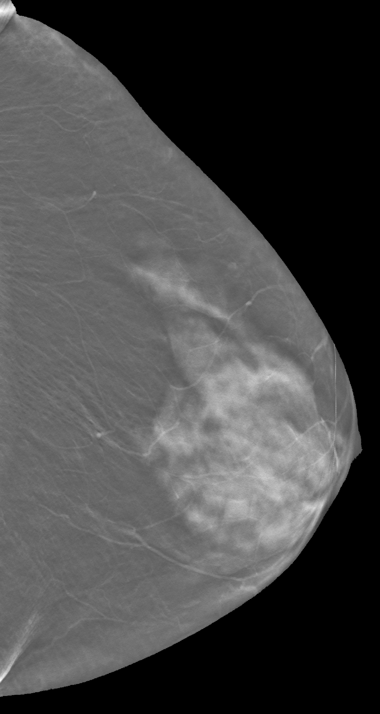
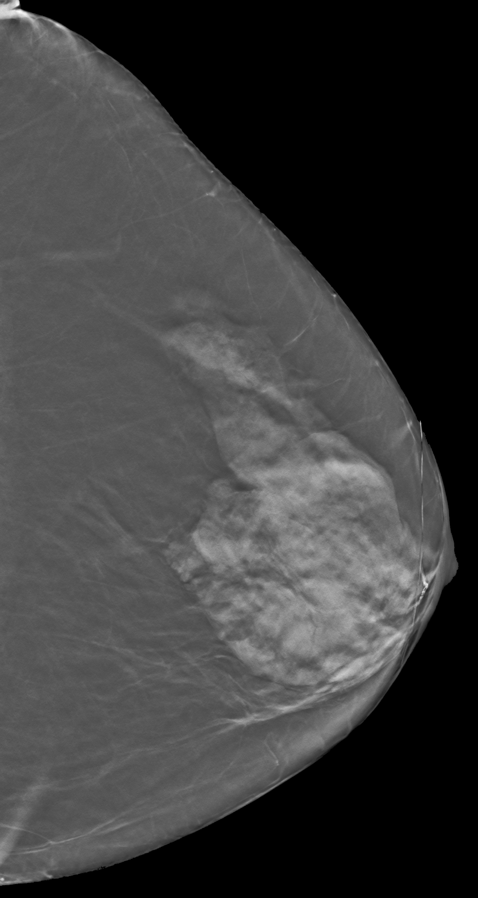
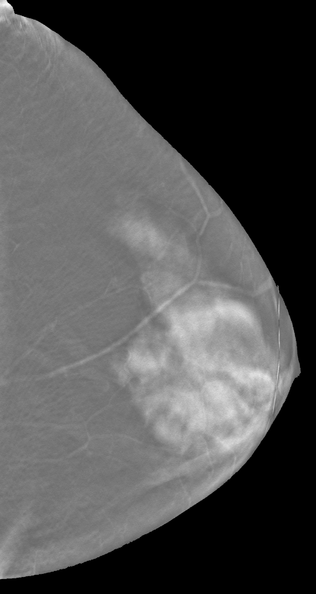
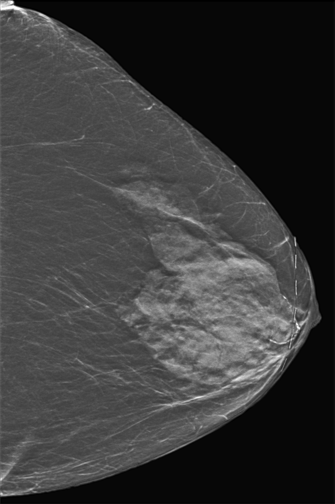

# DBTPNet


## Introduction
This is the official implementation of the paper "Deep Bidirectional and Triplet-based Pedestrian Re-identification Network" (DBTPNet) in PyTorch.

## Requirements
To install requirements:
```pip install -r requirements.txt```

## Samples
We have included one sample, it is located under this drive link: https://drive.google.com/file/d/1k9KgOb7tydhwfbSkHyji1vPn9kHhv7dA/view?usp=drive_link

## Passing the sample through the model
To pass the sample through the model, run this command:
```PYTHONPATH=. python src/main.py```

Before running the command, make sure that:
- the sample is downloaded to the folder `samples/`
- the normalization constants are updated in `config.yaml` if you're using your own sample

## Outputs
The outputs of the model are localised under `outputs/` after passing the sample through the model.

## Visualization

DBT slice 0:



DBT slice 14:




DBT slice 29:



C-View: 


Synthetic 2D:




## References
To cite this work, please use
```
J. Chledowski, J. Park, and K. Geras, 
"Exploring synthesizing 2D mammograms from 3D digital breast tomosynthesis images", 
DICTA2023.
```